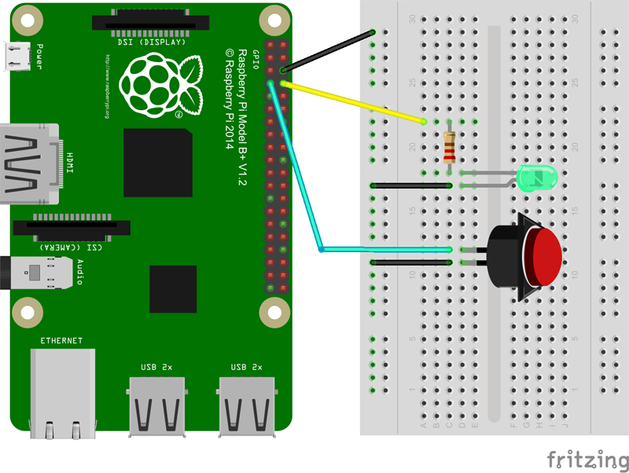

# node-photobooth
Photobooth script for raspberry pi and raspicam using GPIO


## Electronic
### Shopping list
* del
* 220 ohm resistance
* push button
* raspicam

### Schema
>


## Installation
### requirements
* NodeJS
* python

Clone this repo.

Run ```npm install```

Run ```node server``` and ```node app```

Go to http://localhost:3000 in your browser.
Click on your button, wait for pic...
Enjoy !

## How it works
The LED is on to indicate your photobooth is ready to take a pic.
Press the button , the LED goes off , wait three seconds for the first picture is taken, wait 3 seconds for the second picture.
Wait few seconds while your images are assembled.
See your pics.
Retry when the LED goes on.

## Customize
You can customize your app.
Modify or add css in ```public/styles/```.
